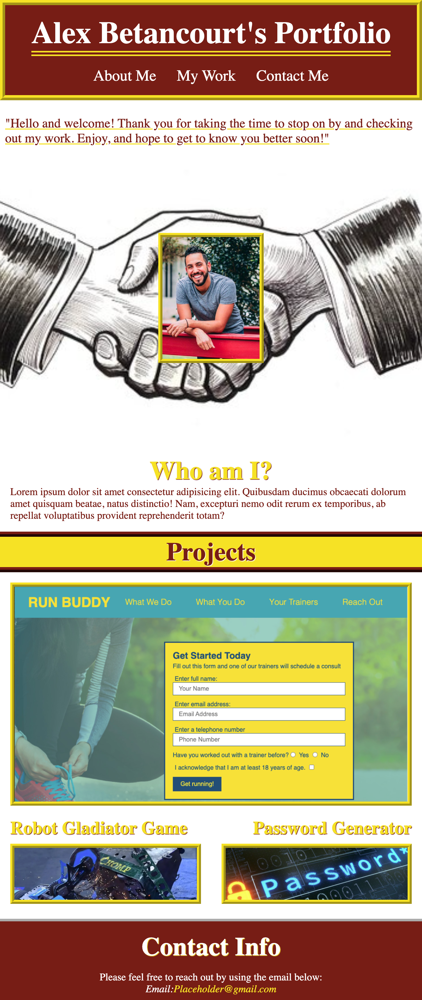

# Portfolio

## Purpose
To build a portfolio page, which you can add to as the course progresses, of works that can showcase your skills and talents to employers looking to fill a part-time or full-time position.

## Built With
* HTML
* CSS

## Website
https://ajbf92.github.io/portfolio/

## Contribution
By Alex Betancourt
